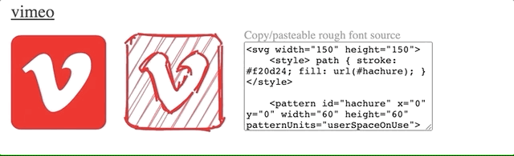

# rough-font-awesome

When [RoughJS](https://roughjs.com/) meets [Font Awesome](https://fontawesome.com/)

See in action: https://djamshed.github.io/rough-awesome-font/dist/

### How?

1. [Download](https://fontawesome.com/download) SVG icon sprites (used Font Awesome Free v5.13.0)

2. Process SVG icons/symbols thru [RoughJS](https://roughjs.com/) (see `src` for implementation)

3. Show (see `dist`)

### Why?

¯\_(ツ)\_/¯

### Credits

[RoughJS](https://roughjs.com/) for hand-drawn effect

[Font Awesome](https://fontawesome.com/) Free v5.13.0 because I needed nice SVG icons

[Awesomeplete](https://leaverou.github.io/awesomplete/) for auto-complete
